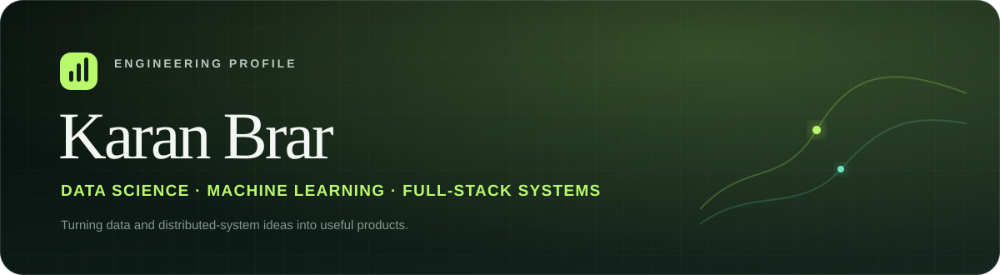

  

  
  
  

## About me

I'm **Karan Brar**, a Data Science student at NIT Jalandhar. I build practical systems across machine learning, distributed backends, and modern web applications—with a strong interest in turning complex engineering ideas into products people can use.

- Currently building **ClinicalPulse**, a pre-clinical triage and clinician command center
- Exploring distributed systems through a Redis, PostgreSQL, and RabbitMQ ticketing platform
- Practicing data structures, algorithms, RAG systems, and applied machine learning
- Based in Jalandhar, Punjab, India

## Engineering analytics

  <picture>
    <source media="(prefers-color-scheme: dark)" srcset="https://github-readme-stats.vercel.app/api?username=Karan-Brar-01&show_icons=true&include_all_commits=true&rank_icon=percentile&hide_border=true&bg_color=0d1512&title_color=baf86b&text_color=b9c8c1&icon_color=70e5c1" />
    <source media="(prefers-color-scheme: light)" srcset="https://github-readme-stats.vercel.app/api?username=Karan-Brar-01&show_icons=true&include_all_commits=true&rank_icon=percentile&hide_border=true&bg_color=f6fbf7&title_color=2f6d3a&text_color=26372f&icon_color=278f73" />
    
  </picture>
  <picture>
    <source media="(prefers-color-scheme: dark)" srcset="https://github-readme-stats.vercel.app/api/top-langs/?username=Karan-Brar-01&layout=compact&langs_count=8&hide_border=true&bg_color=0d1512&title_color=baf86b&text_color=b9c8c1" />
    <source media="(prefers-color-scheme: light)" srcset="https://github-readme-stats.vercel.app/api/top-langs/?username=Karan-Brar-01&layout=compact&langs_count=8&hide_border=true&bg_color=f6fbf7&title_color=2f6d3a&text_color=26372f" />
    
  </picture>

  <picture>
    <source media="(prefers-color-scheme: dark)" srcset="https://streak-stats.demolab.com?user=Karan-Brar-01&hide_border=true&background=0D1512&ring=BAF86B&fire=FFAE72&currStreakLabel=70E5C1&sideLabels=B9C8C1&currStreakNum=F3F7F4&sideNums=F3F7F4&dates=7D9288" />
    <source media="(prefers-color-scheme: light)" srcset="https://streak-stats.demolab.com?user=Karan-Brar-01&hide_border=true&background=F6FBF7&ring=2F6D3A&fire=D76B2E&currStreakLabel=278F73&sideLabels=52665B&currStreakNum=18271F&sideNums=18271F&dates=6D7D74" />
    
  </picture>

<picture>
  <source media="(prefers-color-scheme: dark)" srcset="https://github-readme-activity-graph.vercel.app/graph?username=Karan-Brar-01&bg_color=0d1512&color=b9c8c1&line=baf86b&point=70e5c1&area=true&area_color=5d8f46&hide_border=true&custom_title=Contribution%20Activity" />
  <source media="(prefers-color-scheme: light)" srcset="https://github-readme-activity-graph.vercel.app/graph?username=Karan-Brar-01&bg_color=f6fbf7&color=26372f&line=2f6d3a&point=278f73&area=true&area_color=a7d49a&hide_border=true&custom_title=Contribution%20Activity" />
  
</picture>

## Technology focus

  

## Featured work

  <a href="https://github.com/Karan-Brar-01/ClinicalPulse">
    <picture>
      <source media="(prefers-color-scheme: dark)" srcset="https://github-readme-stats.vercel.app/api/pin/?username=Karan-Brar-01&repo=ClinicalPulse&hide_border=true&bg_color=0d1512&title_color=baf86b&text_color=b9c8c1&icon_color=70e5c1" />
      <source media="(prefers-color-scheme: light)" srcset="https://github-readme-stats.vercel.app/api/pin/?username=Karan-Brar-01&repo=ClinicalPulse&hide_border=true&bg_color=f6fbf7&title_color=2f6d3a&text_color=26372f&icon_color=278f73" />
      
    </picture>
  </a>
  <a href="https://github.com/Karan-Brar-01/distributed-ticketing-system">
    <picture>
      <source media="(prefers-color-scheme: dark)" srcset="https://github-readme-stats.vercel.app/api/pin/?username=Karan-Brar-01&repo=distributed-ticketing-system&hide_border=true&bg_color=0d1512&title_color=baf86b&text_color=b9c8c1&icon_color=70e5c1" />
      <source media="(prefers-color-scheme: light)" srcset="https://github-readme-stats.vercel.app/api/pin/?username=Karan-Brar-01&repo=distributed-ticketing-system&hide_border=true&bg_color=f6fbf7&title_color=2f6d3a&text_color=26372f&icon_color=278f73" />
      
    </picture>
  </a>

## Contribution flow

  <picture>
    <source media="(prefers-color-scheme: dark)" srcset="https://raw.githubusercontent.com/Karan-Brar-01/Karan-Brar-01/output/github-contribution-grid-snake-dark.svg" />
    <source media="(prefers-color-scheme: light)" srcset="https://raw.githubusercontent.com/Karan-Brar-01/Karan-Brar-01/output/github-contribution-grid-snake.svg" />
    
  </picture>

  Analytics reflect public GitHub activity and may update with a short delay.

